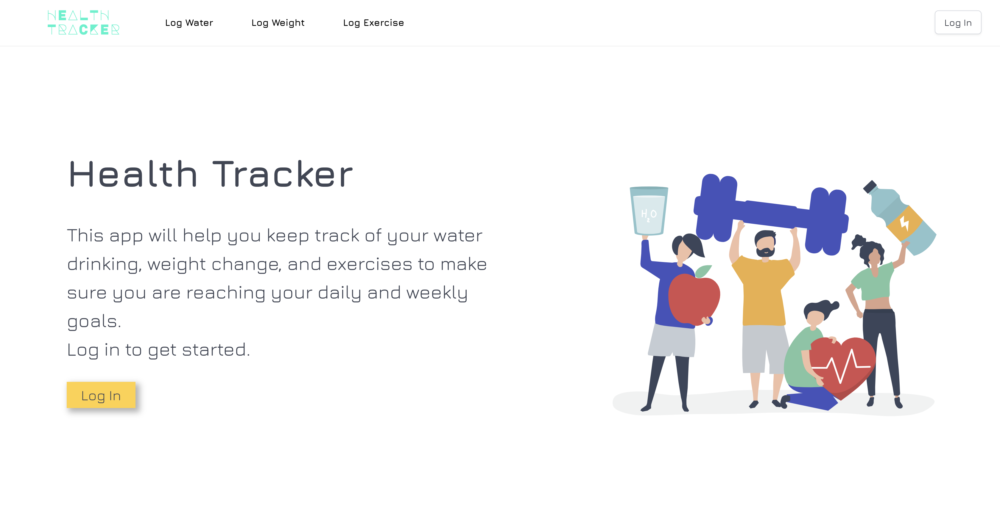
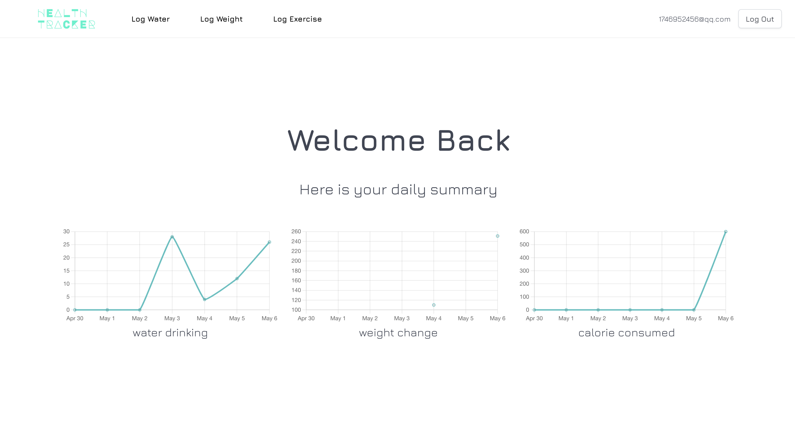
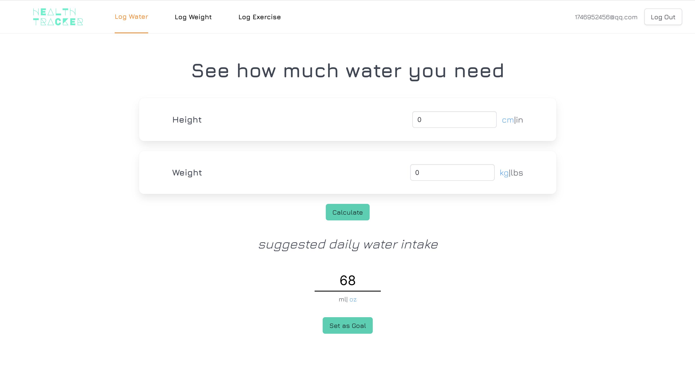
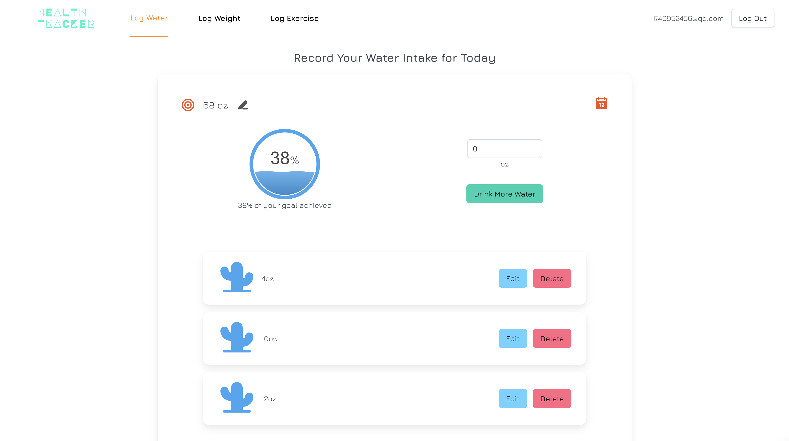
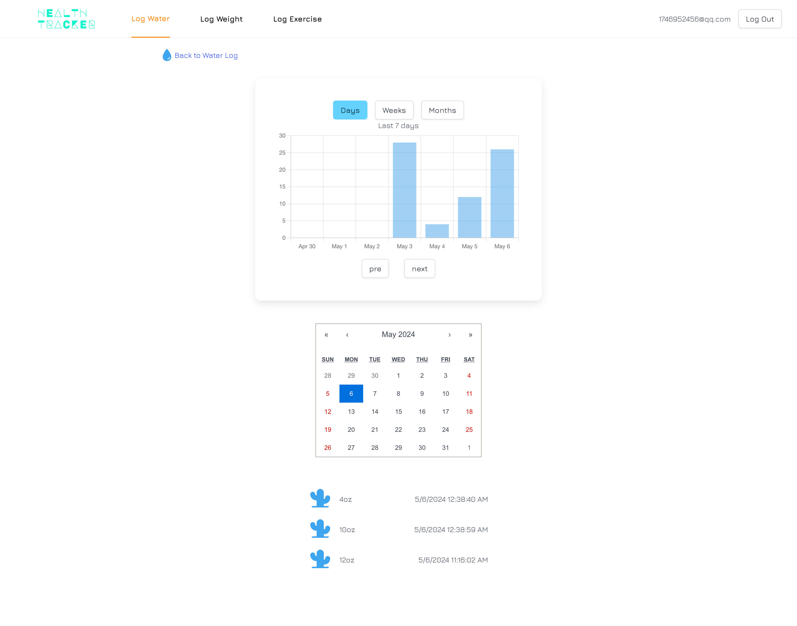
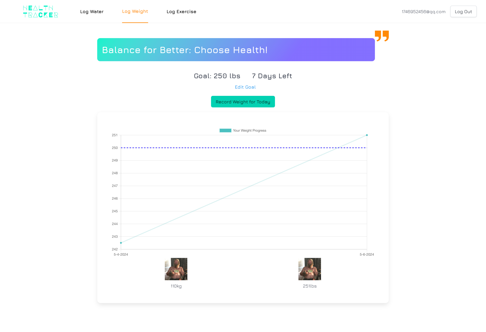
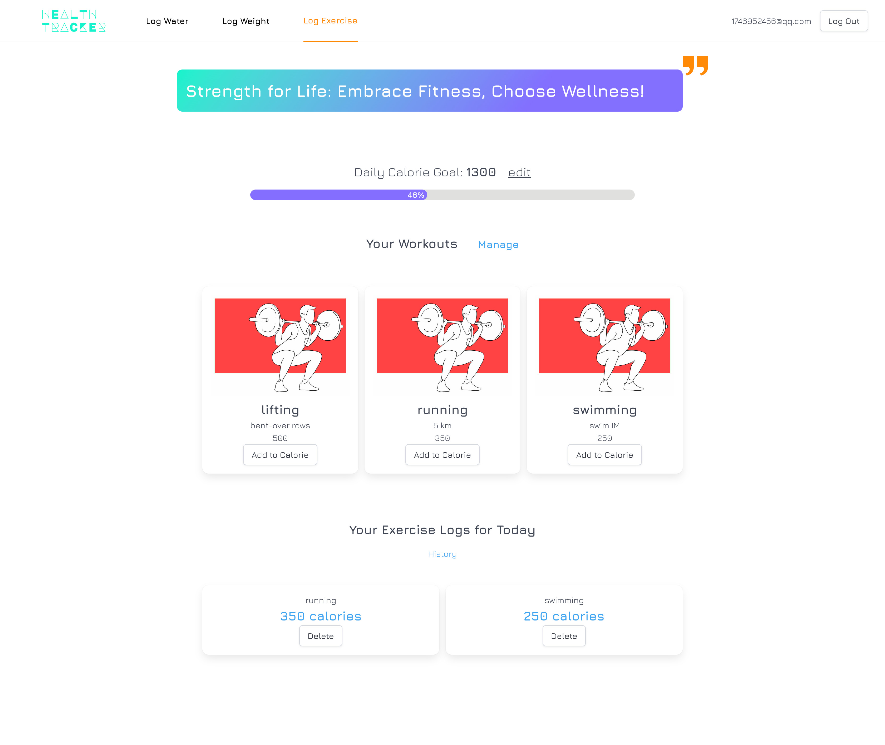
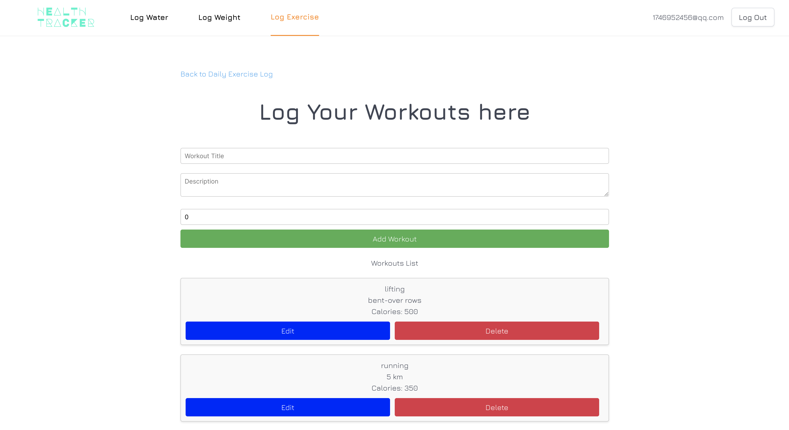

# Module 2 Group Assignment

CSCI 5117, Spring 2024, [assignment description](https://canvas.umn.edu/courses/413159/pages/project-2)

## App Info:

- Team Name: WASD
- App Name: Health Tracker
- App Link: <https://black-bay-07d1c5410.5.azurestaticapps.net/>

### Students

- Maurice Yu, yu000464@umn.edu
- Dominic Deiman, deima013@umn.edu
- Ling Wang, wan01872@umn.edu
- Salma Abdi, abdi0300@umn.edu
- Stuti Shah, shah0794@umn.edu

## Key Features

**Describe the most challenging features you implemented
(one sentence per bullet, maximum 4 bullets):**

- Using Cloudinary to store user pictures.
- Enabling unit switch for water log.
- Calculating and formatting statistic data.

Which (if any) device integration(s) does your app support?

- Camera Integration

Which (if any) progressive web app feature(s) does your app support?

- Camera Integration

## Mockup images

[Link to Figma](https://www.figma.com/file/8A0UDreILkoHiPGDTwKHhq/Untitled?type=design&node-id=43-460&mode=design&t=U4Nb8MSPDqZ8Vu1K-0)

## Testing Notes

**Is there anything special we need to know in order to effectively test your app? (optional):**

- ...

## Screenshots of Site (complete)

homepage

water log

weight log

exercise log

## External Dependencies

**Document integrations with 3rd Party code or services here.
Please do not document required libraries (e.g., React, Azure serverless functions, Azure nosql).**

- cloudinary/react & cloudinary/url-gen: for image storage
- react-chartjs-2: for displaying graphs
- react-liquid-gauge: beautiful UI for displaying progress
- react-loading: for displaying of loading state

**If there's anything else you would like to disclose about how your project
relied on external code, expertise, or anything else, please disclose that
here:**

...
